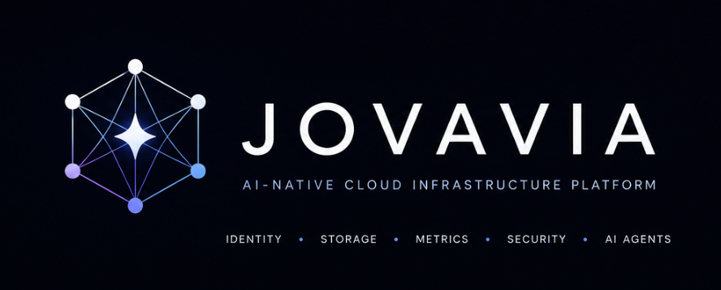

  

<h1 align="center">Jovavia</h1>

AI-Native Cloud Infrastructure Platform

Identity • Storage • Metrics • Security • AI Agents

---

## Building Infrastructure That Powers Intelligence

Jovavia is a production-grade cloud platform inspired by hyperscale infrastructure systems.

### Core Services

| Service | Purpose |
|---------|---------|
| 🛡️ Identity | Authentication, Authorization, RBAC |
| 🔗 Links | Distributed URL Shortener |
| 📦 Vault | Object Storage Platform |
| ⚡ Shield | Distributed Rate Limiter |
| 📊 Pulse | Metrics & Observability |
| 🛡️ Guardian | Code Security Platform |
| 🤖 Agents | Autonomous Code, Review & Test Agents |

### Engineering Stack

Java 21 · Spring Boot · PostgreSQL · Redis · Kafka · Kubernetes · Temporal · OpenTelemetry · Prometheus · Grafana

**Built with ❤️ in Bengaluru, India.**
